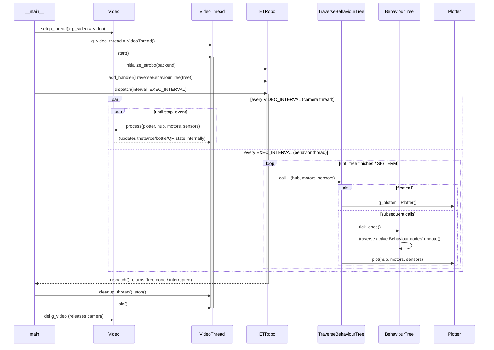
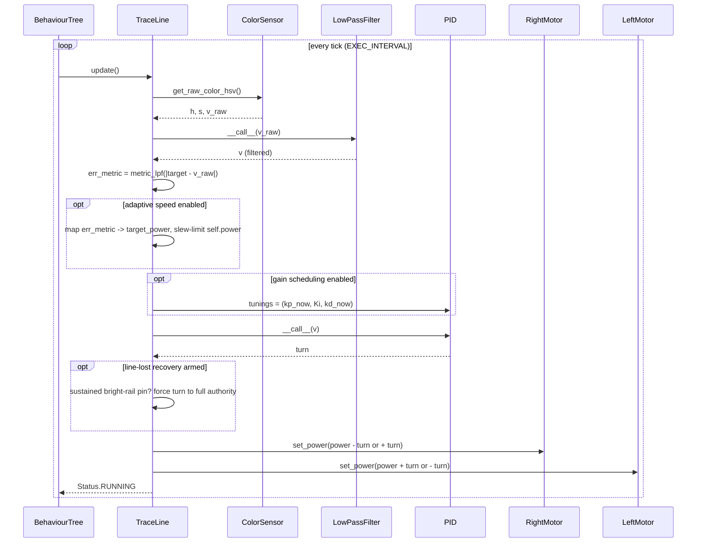
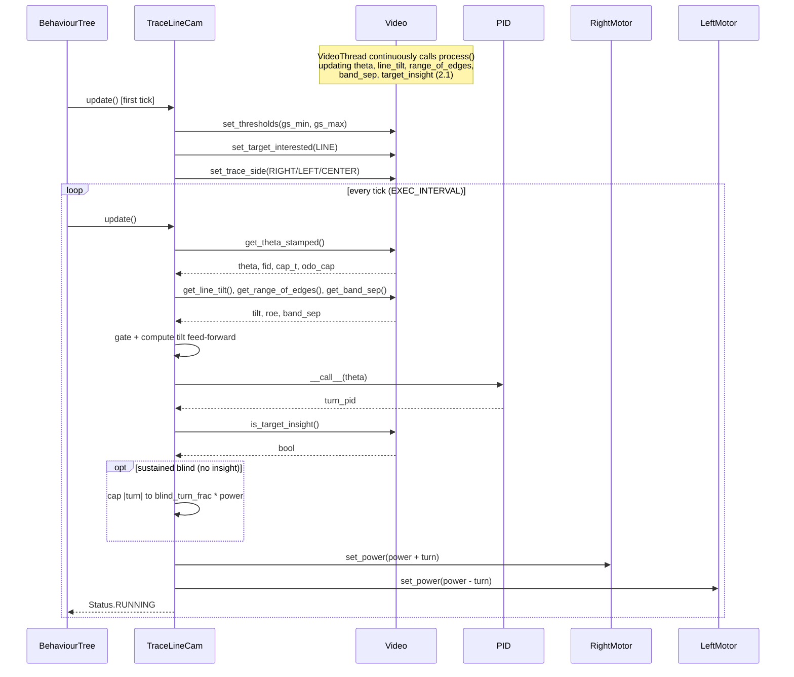
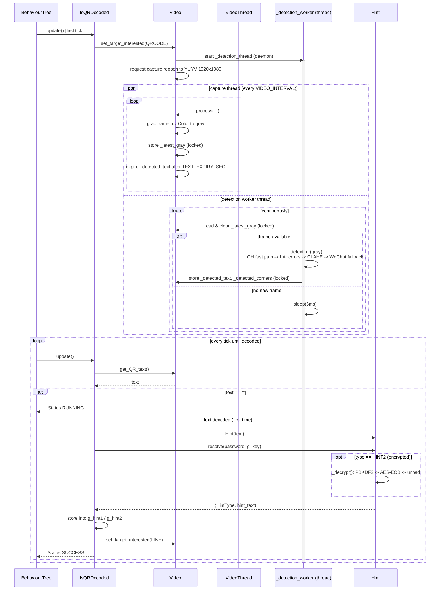
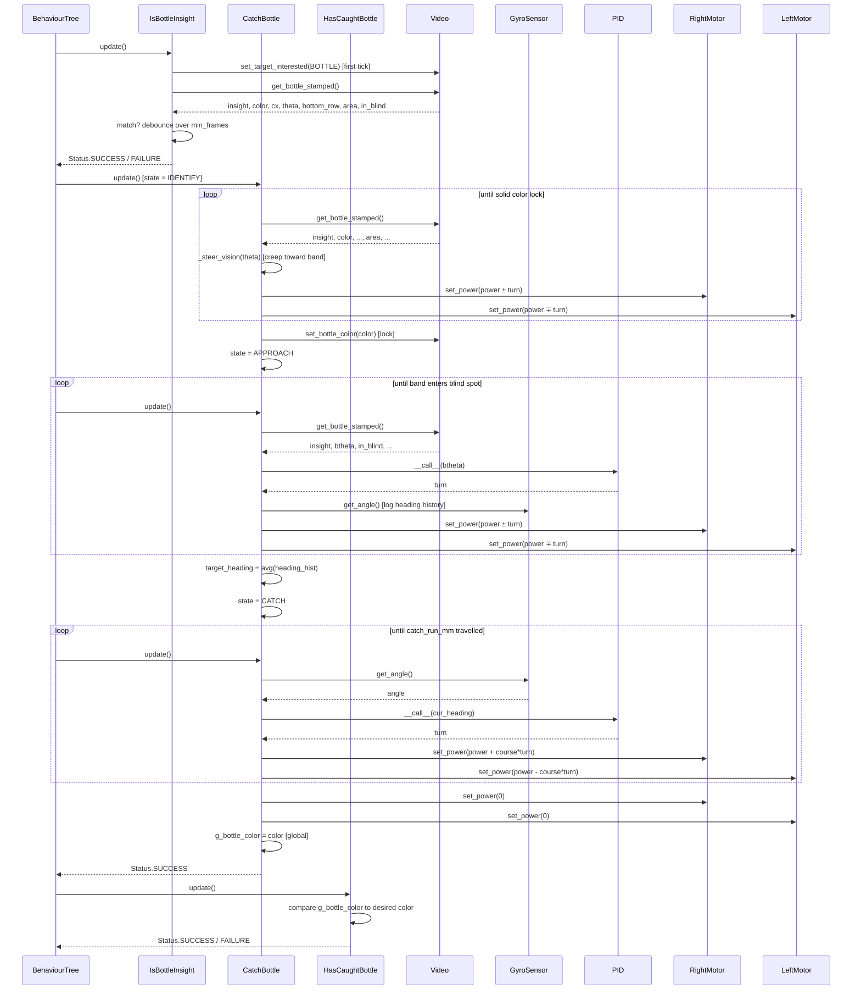
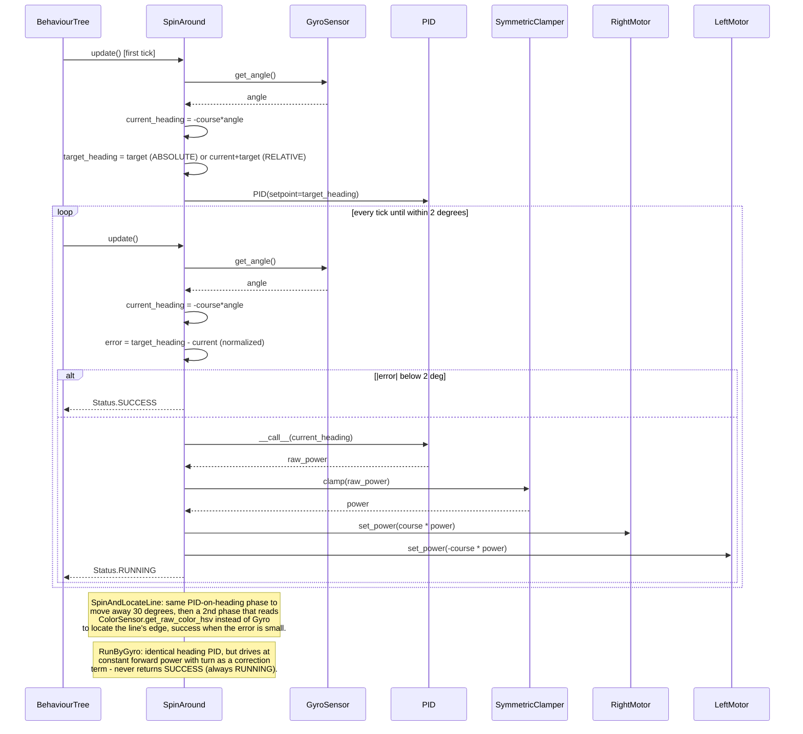
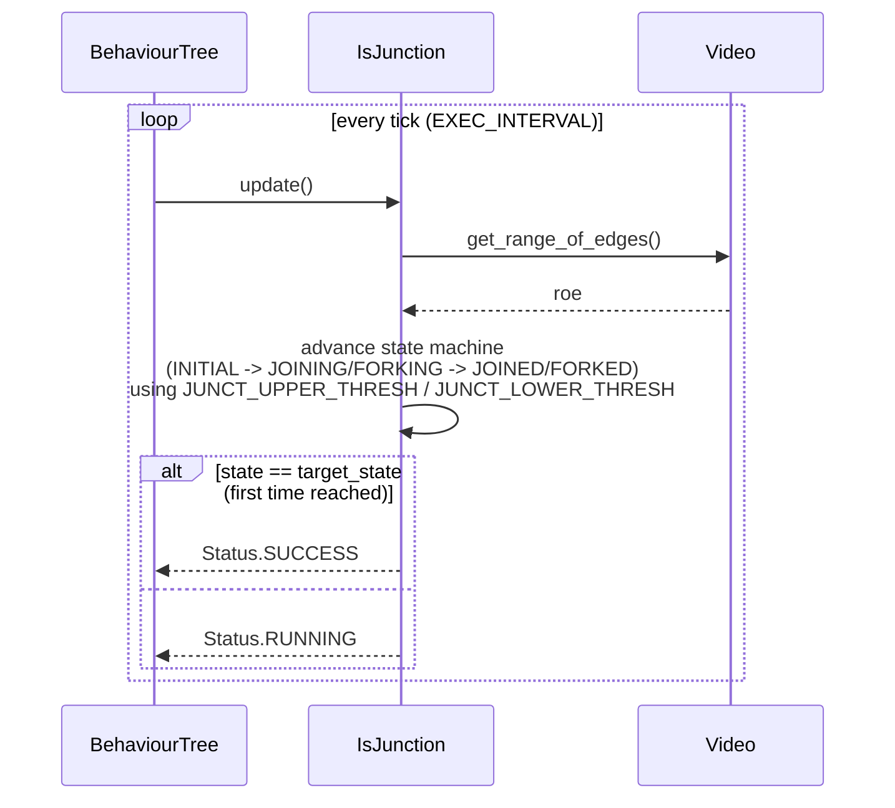

# EV3RT `2026base` — Architecture Reference

This document covers the `2026base` course-running program from the
[EV3RT](https://github.com/wataniguchi/EV3RT) repo:

- **`2026base/sample.py`** — a `py_trees` behavior tree that drives an ETRobo-based
  LEGO robot around a competition course: line following, gyro-based turns, QR-code
  reading, and bottle catching.
- **`2026base/py_etrobo_util/`** — the support library it depends on: `Video`
  (camera/line/QR/bottle vision), `Plotter` (dead-reckoning odometry), and small
  utilities (`ColorClassifier`, `LowPassFilter`, `SymmetricClamper`, `Hint`).

Three complementary views are merged here, each answering a different question:

| Section | Question it answers |
|---|---|
| [1. Class Diagram](#1-class-diagram) | What are the pieces, and how are they wired together? |
| [2. Sequence Diagrams by Subsystem](#2-sequence-diagrams-by-subsystem) | For a given capability (line tracing, QR reading, bottle catching, ...), who calls whom, in what order, across ticks and threads? |
| [3. Execution Flow](#3-execution-flow) | What actually happens, top to bottom, over the course of one full run? |

## How the pieces fit together

The program has exactly two independently-running loops, tied together only by a
handful of shared globals (`g_video`, `g_plotter`, `g_hub`, the motor/sensor handles):

- **The behavior-tree loop**, driven by `ETRobo.dispatch()` at `EXEC_INTERVAL`
  (0.02s). Each tick, `TraverseBehaviourTree.__call__()` ticks the `py_trees`
  `BehaviourTree` built by `build_behaviour_tree()` (Section 3), which in turn calls
  `update()` on whichever leaf `Behaviour` subclass (Section 1) is currently active —
  those leaves are what Section 2's subsystem diagrams zoom into.
- **The camera-capture loop**, driven by `VideoThread` at `VIDEO_INTERVAL` (0.02s),
  which repeatedly calls `Video.process()`. This is where line position (`theta`),
  junction signal (`range_of_edges`), bottle contours, and QR frames are all computed
  and published for the behavior-tree loop to read.

Sections 1 and 2 describe the same classes/objects from two angles (static structure
vs. runtime interaction); Section 3 describes the mission script that decides, tick by
tick, which of those interactions is currently in play.

---

## 1. Class Diagram

Static structure of `sample.py` and `py_etrobo_util`: every `Behaviour` subclass
(the tree's leaf nodes), the two orchestration classes (`TraverseBehaviourTree`,
`VideoThread`), and the support library they depend on (`Video`, `Plotter`, and the
small utility/enum classes). Solid arrows are "uses/reads a value from"; `*--` is
"creates and owns an instance of"; dashed `..>` is "drives via the shared global
instance" (i.e., not a constructor-time dependency, but a runtime one through
`g_video` / `g_plotter`).

```mermaid
classDiagram
    direction LR

    %% =========================================================
    %% External base classes (not defined in these files)
    %% =========================================================
    class Behaviour {
        <<external: py_trees>>
    }
    class Thread {
        <<external: threading>>
    }

    %% =========================================================
    %% py_etrobo_util/util.py
    %% =========================================================
    class SymmetricClamper {
        +float min_val
        +float max_val
        +__init__(min_val, max_val)
        +clamp(value) float
    }

    class Color {
        <<enumeration>>
        BLACK
        BLUE
        RED
        YELLOW
        GREEN
        WHITE
        UNKNOWN
    }

    class ColorClassifier {
        -deque window
        +__init__()
        +classify_single(h, s, v) Color
        +classify_robust(window) Color
        +classify(h, s, v) Color
    }

    class LowPassFilter {
        -float alpha
        -float y
        -int _mwin
        -list _buf
        +__init__(cutoff_hz, sample_time, median_window)
        +reset()
        +__call__(x) float
    }

    %% =========================================================
    %% py_etrobo_util/hint.py
    %% =========================================================
    class HintType {
        <<enumeration>>
        HINT1
        HINT2
        UNKNOWN
    }

    class Hint {
        +str PASSWORD$
        +str raw
        +HintType type
        +__init__(raw)
        -_classify(s) HintType$
        +is_hint1 bool
        +is_hint2 bool
        -_decrypt(password) str
        +resolve(password) Tuple~HintType, str~
    }
    Hint --> HintType : classifies as

    %% =========================================================
    %% py_etrobo_util/plotter.py
    %% =========================================================
    class Plotter {
        +bool running
        +float distance
        +float loc_x
        +float loc_y
        +float prev_azimuth
        +__init__()
        +plot(hub, arm_motor, right_motor, left_motor, touch_sensor, color_sensor, sonar_sensor, gyro_sensor)
        +get_distance() int
        +get_azimuth() int
        +get_degree() int
        +get_loc_x() int
        +get_loc_y() int
    }

    %% =========================================================
    %% py_etrobo_util/video.py
    %% =========================================================
    class TraceSide {
        <<enumeration>>
        NORMAL
        OPPOSITE
        RIGHT
        LEFT
        CENTER
    }

    class TargetInterested {
        <<enumeration>>
        LINE
        QRCODE
        BOTTLE
    }

    class BottleColor {
        <<enumeration>>
        NONE
        RED
        BLUE
        YELLOW
        BLACK
    }

    class Video {
        +TargetInterested target_interested
        +TraceSide trace_side
        +tuple roi
        +int cx
        +int cy
        +int mx
        +float theta
        +BottleColor bottle_color
        +__init__()
        +__del__()
        -_open_cap(fourcc, width, height, fps)
        -_result_pos_to_corners(r)
        -_extract_roi(result, crop)
        -_wechat_decode_roi(roi)
        -_detect_qr(img_gray)
        -_detection_worker()
        +process(plotter, hub, arm_motor, right_motor, left_motor, color_sensor, sonar_sensor, gyro_sensor)
        +get_theta() float
        +get_theta_stamped()
        +get_line_tilt() float
        +get_band_sep() int
        +get_range_of_edges() int
        -_bottle_mask(img_hsv, color)
        +get_bottle_stamped()
        +get_bottle_color() BottleColor
        +set_bottle_color(color)
        +get_QR_text() str
        +set_thresholds(gs_min, gs_max)
        +set_trace_side(trace_side)
        +set_target_interested(target_interested)
        +is_target_insight() bool
    }
    Video --> TargetInterested : tracks
    Video --> TraceSide : tracks
    Video --> BottleColor : reports
    Video ..> Plotter : uses (process)

    %% =========================================================
    %% sample.py - supporting enums
    %% =========================================================
    class ArmDirection {
        <<enumeration (IntEnum)>>
        UP
        DOWN
    }

    class JState {
        <<enumeration>>
        INITIAL
        JOINING
        JOINED
        FORKING
        FORKED
    }

    class HeadingType {
        <<enumeration>>
        ABSOLUTE
        RELATIVE
    }

    %% =========================================================
    %% sample.py - Behaviour tree leaf nodes
    %% =========================================================
    class TheEnd {
        +__init__(name)
        +update() Status
    }
    class ResetDevice {
        +__init__(name)
        +update() Status
    }
    class ArmUpDownFull {
        +ArmDirection direction
        +__init__(name, direction)
        +update() Status
    }
    class ReadKey {
        +__init__(name)
        +update() Status
    }
    class IsTimePassed {
        +int delta_time
        +__init__(name, delta_time)
        +update() Status
    }
    class IsDistanceEarned {
        +int delta_dist
        +__init__(name, delta_dist)
        +update() Status
    }
    class IsColorDetected {
        +Color color
        +ColorClassifier classifier
        +__init__(name, color)
        +update() Status
    }
    class IsQRDecoded {
        +__init__(name)
        +update() Status
    }
    class IsSonarOn {
        +int alert_dist
        +__init__(name, alert_dist)
        +update() Status
    }
    class IsTouchOn {
        +__init__(name)
        +update() Status
    }
    class StopNow {
        +__init__(name)
        +update() Status
    }
    class RunAsInstructed {
        +int pwm_l
        +int pwm_r
        +__init__(name, pwm_l, pwm_r)
        +update() Status
    }
    class TraceLine {
        +LowPassFilter lpf
        +LowPassFilter metric_lpf
        +__init__(name, target, power, pid_p, pid_i, pid_d, ...)
        +update() Status
    }
    class SpinAndLocateLine {
        +SymmetricClamper clamper
        +__init__(name, target, max_power, min_power, ...)
        +update() Status
    }
    class SpinAround {
        +SymmetricClamper clamper
        +__init__(name, target, max_power, min_power, ...)
        +update() Status
    }
    class RunByGyro {
        +__init__(name, target, power, ...)
        +update() Status
    }
    class TraceLineCam {
        +TraceSide trace_side
        +int gs_min
        +int gs_max
        +__init__(name, power, pid_p, pid_i, pid_d, gs_min, gs_max, trace_side, ...)
        +update() Status
    }
    class IsJunction {
        +JState target_state
        +JState state
        +__init__(name, target_state)
        +update() Status
    }
    class CatchBottle {
        +int IDENTIFY$
        +int APPROACH$
        +int CATCH$
        +BottleColor lock_color
        +__init__(name, power, pid_p, pid_i, pid_d, ...)
        -_cur_heading() int
        -_steer_vision(theta)
        +update() Status
    }
    class IsBottleInsight {
        +BottleColor color
        +__init__(name, color, min_area, min_frames, set_target)
        +update() Status
    }
    class HasCaughtBottle {
        +BottleColor color
        +__init__(name, color)
        +update() Status
    }

    %% =========================================================
    %% sample.py - orchestration classes
    %% =========================================================
    class TraverseBehaviourTree {
        +BehaviourTree tree
        +bool running
        +__init__(tree)
        +__call__(hub, arm_motor, right_motor, left_motor, touch_sensor, color_sensor, sonar_sensor, gyro_sensor)
    }
    class VideoThread {
        -Event _stop_event
        -float prev_time
        +__init__()
        +stop()
        +run()
    }

    %% =========================================================
    %% Inheritance
    %% =========================================================
    Behaviour <|-- TheEnd
    Behaviour <|-- ResetDevice
    Behaviour <|-- ArmUpDownFull
    Behaviour <|-- ReadKey
    Behaviour <|-- IsTimePassed
    Behaviour <|-- IsDistanceEarned
    Behaviour <|-- IsColorDetected
    Behaviour <|-- IsQRDecoded
    Behaviour <|-- IsSonarOn
    Behaviour <|-- IsTouchOn
    Behaviour <|-- StopNow
    Behaviour <|-- RunAsInstructed
    Behaviour <|-- TraceLine
    Behaviour <|-- SpinAndLocateLine
    Behaviour <|-- SpinAround
    Behaviour <|-- RunByGyro
    Behaviour <|-- TraceLineCam
    Behaviour <|-- IsJunction
    Behaviour <|-- CatchBottle
    Behaviour <|-- IsBottleInsight
    Behaviour <|-- HasCaughtBottle
    Thread <|-- VideoThread

    %% =========================================================
    %% sample.py -> py_etrobo_util dependencies
    %% =========================================================
    ArmUpDownFull --> ArmDirection : uses
    IsJunction --> JState : uses
    IsColorDetected *-- ColorClassifier : creates
    IsColorDetected --> Color : uses
    IsQRDecoded ..> Hint : creates
    IsQRDecoded ..> HintType : uses
    TraceLine *-- LowPassFilter : creates
    SpinAndLocateLine *-- SymmetricClamper : creates
    SpinAround *-- SymmetricClamper : creates
    TraceLineCam --> TraceSide : uses
    TraceLineCam ..> Video : drives (g_video)
    TraceLineCam ..> TargetInterested : sets
    CatchBottle --> BottleColor : uses
    CatchBottle ..> Video : drives (g_video)
    CatchBottle ..> TargetInterested : sets
    IsBottleInsight --> BottleColor : uses
    IsBottleInsight ..> Video : reads (g_video)
    HasCaughtBottle --> BottleColor : uses
    TraverseBehaviourTree *-- Plotter : creates (g_plotter)
    VideoThread ..> Video : drives (g_video)
    VideoThread ..> Plotter : reads (g_plotter)
```

---

## 2. Sequence Diagrams by Subsystem

Seven subsystems, each covering one behavior-tree pattern from `sample.py` and its
interaction with `py_etrobo_util`. `EXEC_INTERVAL` = the behavior-tree tick period
(0.02s); `VIDEO_INTERVAL` = the camera-capture thread period (0.02s, runs concurrently
in `VideoThread`).

### 2.1 Application Bootstrap & Concurrent Main Loop

Two independent loops run for the whole mission: the `ETRobo` tick loop (behavior
tree + odometry) and the `VideoThread` capture loop (camera). They only communicate
through the shared globals `g_video` / `g_plotter`, guarded inside `Video` by its own
locks.

### 2.2 Sensor-Based Line Tracing (`TraceLine`)

Uses the onboard color sensor directly (no camera). Runs a PID on filtered
brightness, with adaptive speed and gain-scheduling layered on top.

### 2.3 Camera-Based Line Tracing (`TraceLineCam`)

The heading error (`theta`) and curvature signals are produced continuously by the
camera thread's `Video.process()` (see 2.1); `TraceLineCam` only reads the latest
published values each tick — it never calls `process()` itself.

### 2.4 QR Code Detection & Decoding

Three concurrent actors: the capture thread (feeds gray frames), a dedicated
`_detection_worker` background thread inside `Video` (runs the zxing/WeChat
pipeline), and the behavior-tree node `IsQRDecoded` that polls the result and
decrypts it via `Hint`.

### 2.5 Bottle Catching (`IsBottleInsight` → `CatchBottle` → `HasCaughtBottle`)

`CatchBottle` is an internal 3-state machine (IDENTIFY → APPROACH → CATCH) that
runs across many ticks. `Video`'s BOTTLE-mode contour detection (populated by
`process()`, 2.1) is the only sensor input during IDENTIFY/APPROACH; CATCH switches
to gyro-only heading hold.

### 2.6 Gyro-Based Turning (`SpinAround` / `SpinAndLocateLine` / `RunByGyro`)

All three share the same "PID on absolute heading" core; `SpinAround` is shown as
the representative flow, with notes on how the other two diverge.

### 2.7 Junction Detection (`IsJunction`)

A lightweight condition node that classifies line-merges/forks from the camera's
"range of edges" signal, using its own small state machine.

---

## 3. Execution Flow

This reads the tree built by `build_behaviour_tree()` the way it actually *runs*, not
how it's structured. The root `Sequence` walks top-to-bottom through 24 phases, one at
a time, never starting the next phase until the current one reports success.

Most phases are a `Parallel(SuccessOnOne)` with two children: one does the actual
driving (steering/spinning/moving forever, returning `RUNNING`), the other just
watches a sensor. The phase ends — and the robot instantly moves to the next line —
the moment the watcher fires. These are drawn below as a small **race** box: both
sides start together, the phase exits as soon as either side succeeds (in practice
always the watcher, since the driver never stops on its own). Several of these race
boxes map directly onto the subsystem diagrams above — e.g. every `TraceLine` "drive"
box is subsystem 2.2, every `RunByGyro`/`SpinAround` box is subsystem 2.6.

```mermaid
flowchart TD
    START(["Mission start<br/>(course = left or right)"])

    CAL["Calibration<br/>1) raise arm  2) lower arm  3) reset device"]
    START --> CAL

    TOUCH{"Wait for touch sensor press"}
    CAL --> TOUCH

    subgraph LAP2["Lap2"]
        direction LR
        LAP2D["drive: TraceLine, hug normal edge<br/>power 70→33 adaptive"]
        LAP2X{"watch: color = BLUE?"}
    end
    TOUCH --> LAP2

    subgraph LAP3["Lap3"]
        direction LR
        LAP3D["drive: RunByGyro, heading 3°, power 33"]
        LAP3X{"watch: traveled 370 mm?"}
    end
    LAP2 --> LAP3

    subgraph CARRY1["Carry1"]
        direction LR
        C1D["drive: TraceLine, hug normal edge<br/>power 70→33 adaptive"]
        C1X{"watch: color = BLUE?"}
    end
    LAP3 --> CARRY1

    subgraph CARRY2["Carry2"]
        direction LR
        C2D["drive: RunByGyro, heading 90°, power 33"]
        C2X{"watch: traveled 120 mm?"}
    end
    CARRY1 --> CARRY2

    subgraph CARRY3["Carry3"]
        direction LR
        C3D["drive: TraceLine, hug normal edge<br/>power 70→33 adaptive"]
        C3X{"watch: traveled 1100 mm?"}
    end
    CARRY2 --> CARRY3

    subgraph CARRY4["Carry4"]
        direction LR
        C4D["drive: TraceLine, hug normal edge<br/>power 33 constant"]
        C4X{"watch: color = BLUE?"}
    end
    CARRY3 --> CARRY4

    FACE["Spin to heading 10° (about-face)"]
    CARRY4 --> FACE

    subgraph QR2["qr2"]
        direction LR
        Q2D["drive: RunByGyro, heading 0°, power 33"]
        Q2X{"watch: traveled 50 mm?"}
    end
    FACE --> QR2

    STOP1["Stop motors"]
    QR2 --> STOP1

    LOCATE["Spin away from line, then locate opposite edge<br/>(2-phase leaf: spin out, then hunt for target 75)"]
    STOP1 --> LOCATE

    STOP2["Stop motors"]
    LOCATE --> STOP2

    subgraph QR3["qr3"]
        direction LR
        Q3D["drive: TraceLine, hug opposite edge<br/>power 33 constant"]
        Q3X{"watch: traveled 500 mm?"}
    end
    STOP2 --> QR3

    subgraph QR4["qr4"]
        direction LR
        Q4D["drive: TraceLine, hug opposite edge<br/>power 70→33 adaptive"]
        Q4X{"watch: color = BLUE?"}
    end
    QR3 --> QR4

    subgraph QR5["qr5"]
        direction LR
        Q5D["drive: RunByGyro, heading -90°, power 33"]
        Q5X{"watch: traveled 100 mm?"}
    end
    QR4 --> QR5

    STOP3["Stop motors"]
    QR5 --> STOP3

    ARMUP["Raise arm"]
    STOP3 --> ARMUP

    ALIGN["Spin to heading 0° (align for QR scan)"]
    ARMUP --> ALIGN

    STOP4["Stop motors"]
    ALIGN --> STOP4

    subgraph QRREAD["qr_read"]
        direction LR
        QRD["watch: camera decodes QR code<br/>(Hint.resolve, may need password)"]

        subgraph SHAKE["qr_scan_shake, runs alongside QRD"]
            direction TB
            SH1["wait 3.0 s"]
            subgraph MOVEBACK["qr_scan_move_back"]
                direction LR
                MBD["drive: reverse, power -47/-47"]
                MBX{"watch: traveled 50 mm?"}
            end
            SH1 --> MOVEBACK
            SH2["stop"] --> SH3["wait 3.0 s"] --> SH4["spin +3° relative"]
            MOVEBACK --> SH2
            SH4 --> SH5["stop"] --> SH6["wait 2.0 s"] --> SH7["spin -6° relative"]
            SH7 --> SH8["stop"] --> SH9["wait 2.0 s"] --> SH10["spin +3° relative"]
            SH10 --> SH11["stop"] --> SH12["wait 3.0 s"]
        end
    end
    STOP4 --> QRREAD

    ARMDOWN["Lower arm"]
    QRREAD --> ARMDOWN

    STOP5["Stop motors"]
    ARMDOWN --> STOP5

    END(["Mission end"])
    STOP5 --> END

    classDef race fill:#ffe8cc,stroke:#cc7a00,stroke-width:1px;
    classDef step fill:#dbe9ff,stroke:#3366cc,stroke-width:1px;
    classDef terminal fill:#d9f2d9,stroke:#2e8b2e,stroke-width:1px;
    class LAP2,LAP3,CARRY1,CARRY2,CARRY3,CARRY4,QR2,QR3,QR4,QR5,QRREAD,MOVEBACK race;
    class CAL,TOUCH,FACE,STOP1,LOCATE,STOP2,STOP3,ARMUP,ALIGN,STOP4,ARMDOWN,STOP5 step;
    class START,END terminal;
```

### Reading it

- **Blue boxes** are ordinary sequential steps: one leaf behavior runs until it
  reports success on its own (a spin that reaches its target heading, a wait timer
  expiring), then the tree moves on.
- **Orange boxes** are the `Parallel(SuccessOnOne)` races: both halves start the
  instant the phase is entered; the "drive" half (steering/moving) runs forever, the
  "watch" half (a distance, color, or QR check) is the one that actually ends the
  phase. This is the dominant pattern for the whole run — nearly every lap/carry/qr
  segment is really "keep tracing the line until *X* happens."
- **`qr_read`** is the one nested exception: it races a single leaf (`IsQRDecoded`)
  against an entire scripted sub-sequence (`qr_scan_shake`) — wait, back up until 50mm
  clear, stop, then three alternating spin-and-settle cycles to sweep the camera
  across the code. Whichever side finishes first — the code actually gets decoded, or
  the shake routine runs its full course — ends the phase.
